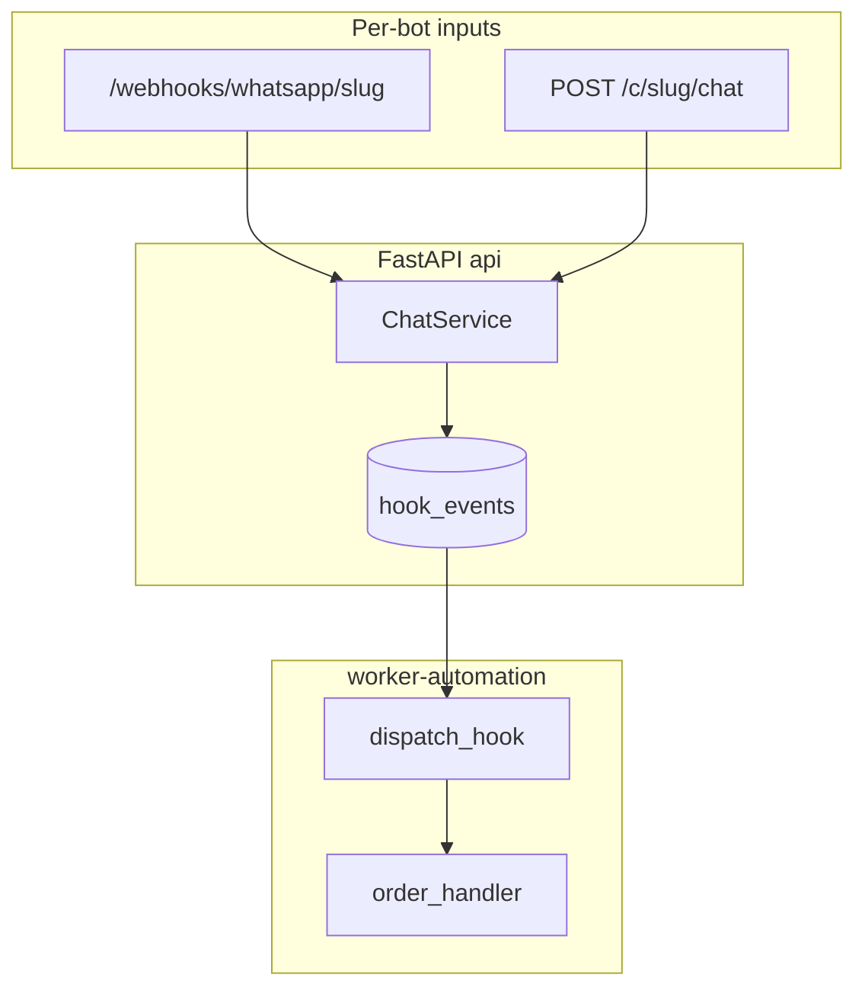

# Chatbot codebase architecture

## Multi-tenant SaaS platform

| Concern | Implementation |
|---------|----------------|
| **Tenants** | `slug`, `token_hash`, `prompt`, `hook_instructions`, `gemini_api_key_enc`, `config_json` |
| **Isolation** | `tenant_id` on messages, orders, hooks, connectors; LanceDB at `data/lancedb/{slug}/` |
| **Public API** | `POST /c/{slug}/chat` — Bearer token must match slug |
| **Admin API** | `/admin/*` with `ADMIN_TOKEN` |
| **Dashboard** | FastAPI + Jinja2 + HTMX — `/auth/login`, `/dashboard/bots`, connectors, hooks |
| **Hooks** | `===HOOK===` in LLM reply → `hook_events`; worker runs `core.orders`; `erpnext.quote` queues validation → ERPNext on approve |
| **Orders** | `automation/handlers/order_handler.py` + `order_service.py` (not in chat path) |
| **Deploy** | `./sail up -d` — MySQL, api, worker-automation, Caddy; `alembic upgrade head` on API start |

See [AGENTS.md](AGENTS.md) for agent-oriented conventions.

---

## Layered layout

| Layer | Path | Role |
|--------|------|------|
| **Domain** | `domain/models/`, `domain/contracts/` | Dataclasses, enums, `Protocol` ports |
| **Application** | `application/` | Chat, RAG, ingest/sync, hooks extract, tenants, users, connectors |
| **Adapters** | `adapters/` | Gemini, LanceDB, SQLAlchemy, parsers, Meta channels, Fernet secrets |
| **Automation** | `automation/` | Hook dispatch + order handler + admin notifier |
| **Interfaces** | `interfaces/api/`, `interfaces/web/` | FastAPI, Jinja dashboard, `worker_automation.py` |
| **Config** | `config/settings.py` | Pydantic settings from `.env` |
| **CLI** | `__main__.py` | Typer: `sync`, `tenant-create`, `user-create`, `serve` |
| **Sail** | `./sail` | Docker Compose wrapper (like Laravel Sail) |

---

## Chat flow (`ChatService`)

1. Append user message (`tenant_id` scoped).
2. Load history (last 50).
3. System instruction = `tenant.prompt` + composed hook instructions from enabled **automation modules** (`config_json.automation_modules`) + optional `hook_instructions_extra`.
4. Optional RAG context.
5. Gemini `generate_chat`.
6. `extract_hook()` — strip `===HOOK===` / legacy `===JF030A===`, parse JSON → `type` + payload.
7. Persist assistant message (clean reply only).
8. If hooks enabled: `HookEventRepository.create` (status `pending`).
9. Return `LlmResult` — **no** order DB writes in API process.

---

## Automation worker

`interfaces/worker_automation.py`: poll `hook_events`, claim `pending` → `processing`, `automation.modules.registry.dispatch_hook`, mark `done` / `failed`.

Order hooks → `core.orders` module → `OrderService` → orders table + optional WhatsApp admin notify.

Quote hooks (`quote.create`) → validation queue with product resolution (ERPNext REST + fuzzy match) → on approve: create Quotation, PDF, send via email/WhatsApp attachment.

---

## Connectors & secrets

Table `connectors`: `direction` in/out, `type` (whatsapp, messenger, instagram, email, chat), `config_enc` (Fernet JSON).

`ConnectorService` decrypts for webhooks and outbound sends. `APP_SECRET_KEY` in `.env` required when storing connectors.

---

## Webhooks (per slug)

| Route | Config source |
|-------|----------------|
| `GET/POST /webhooks/whatsapp/{slug}` | Connector whatsapp in/out |
| `GET/POST /webhooks/messenger/{slug}` | Connector messenger |
| `GET/POST /webhooks/instagram/{slug}` | Connector instagram |

Env `WHATSAPP_*` / `MESSENGER_*` / `INSTAGRAM_*` are optional fallbacks only.

---

## Dashboard & auth

- `users` + `user_bot_access` — roles: `admin`, `client_admin`, `client_operator`.
- Session middleware (`SESSION_SECRET`).
- Routes: `interfaces/api/routers/auth_web.py`, `dashboard_web.py`; templates under `interfaces/web/templates/`.

---

## RAG

Unchanged core: `RagPipeline`, `LanceVectorStore`, `IngestSyncService`, CLI `chatbot sync {slug} path`.

Per-tenant: `config_json.rag_enabled`, models; index path `LANCEDB_ROOT/{slug}/`.

---

## Settings (`.env`)

| Area | Variables |
|------|-----------|
| Platform | `ADMIN_TOKEN`, `APP_SECRET_KEY`, `SESSION_SECRET`, `HOOK_POLL_SECONDS`, `DEV_MODE` |
| Gemini | `GEMINI_API_KEY`, `CHAT_MODEL`, `EMBEDDING_MODEL`, `REWRITE_MODEL` |
| Storage | `DATABASE_URL`, `DATA_ROOT`, `LANCEDB_ROOT` |
| RAG | `RAG_ENABLED`, `RAG_REWRITE_*`, `RAG_TOP_K`, `CHUNK_*`, `RETRIEVAL_LANGUAGE` |
| Orders | `ORDER_MODIFICATION_WINDOW_HOURS` (worker handler) |
| Dev UI | `TENANT_SLUG`, `TENANT_TOKEN` (Streamlit test client) |

**Removed / obsolete:** `CHAT_API_SECRET`, `PROMPT_PATH`, `LANCEDB_PATH`, `WEBHOOK_TENANT_SLUG`.

---

## Quick reference paths

| Concern | Path |
|---------|------|
| Chat | `application/chat_service.py` |
| Hook extract | `application/hook_extractor.py` |
| Chat HTTP | `interfaces/api/routers/chat.py` |
| Deps / per-tenant Gemini | `interfaces/api/deps.py` |
| Dashboard | `interfaces/api/routers/dashboard_web.py` |
| Worker | `interfaces/worker_automation.py` |
| Order automation | `automation/handlers/order_handler.py` |
| Docker helper | `./sail` |
| Compose | `docker-compose.yml` |
