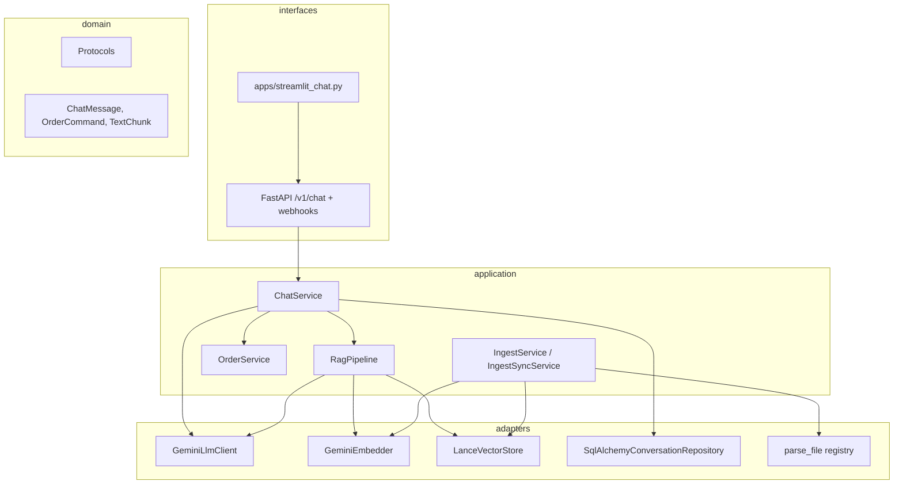

# Chatbot codebase architecture summary

## 1. Overall layered architecture

The project under `/Users/smamet/Sites/chatbot/src/chatbot` follows **hexagonal / ports-and-adapters** style:

| Layer | Path | Role |
|--------|------|------|
| **Domain** | `domain/models/`, `domain/contracts/` | Pure dataclasses/enums + `Protocol` interfaces (no I/O) |
| **Application** | `application/` | Use cases: chat, RAG pipeline, ingest/sync, orders |
| **Adapters** | `adapters/` | Gemini LLM/embeddings, LanceDB, SQLAlchemy, file parsers, Meta channels |
| **Interfaces** | `interfaces/api/` | FastAPI app, routers, DI (`deps.py`) |
| **Config** | `config/settings.py` | Pydantic settings from `.env` |
| **CLI** | `__main__.py` | Typer commands (`sync`, `version`) |

**Outside `src`:** `apps/streamlit_chat.py` is a thin HTTP client; `prompts/system.md` is the default system prompt; `docs/` holds knowledge-base files for RAG sync.



---

## 2. Key files by layer

### Domain (`/Users/smamet/Sites/chatbot/src/chatbot/domain/`)

**Models**
- `/Users/smamet/Sites/chatbot/src/chatbot/domain/models/message.py` — `MessageRole`, `ChatMessage`
- `/Users/smamet/Sites/chatbot/src/chatbot/domain/models/conversation.py` — `Conversation` (aggregate; **not used** by persistence today)
- `/Users/smamet/Sites/chatbot/src/chatbot/domain/models/chunk.py` — `TextChunk` for ingest
- `/Users/smamet/Sites/chatbot/src/chatbot/domain/models/order.py` — orders, items, actions, events

**Contracts (protocols)**
- `conversation_repository.py` — append/list messages
- `llm_client.py` — `generate_chat` → `LlmResult` + `LlmUsage`
- `embedder.py` — `embed_texts`
- `vector_store.py` — `VectorRecord`, `RetrievedChunk`, upsert/search/delete/clear
- `rewrite_language_gate.py` — optional gate before RAG query rewrite
- `order_repository.py` — CRUD + events for orders
- `clock.py` — time for order windows

### Application (`/Users/smamet/Sites/chatbot/src/chatbot/application/`)

| File | Purpose |
|------|---------|
| `chat_service.py` | Main chat orchestration |
| `rag_orchestrator.py` | `RagPipeline`: rewrite → embed → search → format context |
| `ingest_service.py` | Parse files → chunk → embed → LanceDB + `ingested_files` metadata |
| `sync_service.py` | `IngestSyncService`: prune missing files, `--fresh` full reset |
| `order_service.py` | Process `OrderCommand` from LLM marker JSON |
| `order_command_extractor.py` | Strip `===JF030A===` + JSON from assistant reply |
| `admin_notifier.py` | WhatsApp admin notifications on order events |

### Adapters (`/Users/smamet/Sites/chatbot/src/chatbot/adapters/`)

| Area | Files |
|------|-------|
| LLM | `llm/gemini_client.py` |
| Embeddings | `embeddings/gemini_embedder.py` |
| RAG store | `rag/lance_vector_store.py`, `rag/chunker.py`, `rag/parsers/*` |
| RAG language | `rag/fasttext_language_gate.py` (Creole **marker** gate, not fastText) |
| Persistence | `persistence/orm.py`, `conversation_repository.py`, `order_repository.py`, `engine.py` |
| Channels | `channels/whatsapp_meta.py`, `messenger_meta.py`, `instagram_meta.py`, `text_format.py` |

### Interfaces (`/Users/smamet/Sites/chatbot/src/chatbot/interfaces/api/`)

- `main.py` — FastAPI app, lifespan, hot-reload Gemini/Lance clients on `.env` mtime
- `deps.py` — wiring: DB session, `ChatService`, auth, `OrderService`
- `routers/chat.py` — `POST /v1/chat`
- `routers/whatsapp_webhook.py`, `messenger_webhook.py`, `instagram_webhook.py` — Meta inbound → same `ChatService`

---

## 3. How `ChatService` works

`/Users/smamet/Sites/chatbot/src/chatbot/application/chat_service.py` is the central use case:

1. **Persist user message** — `ChatMessage(role=USER)` via `ConversationRepository.append_message(session_id, ...)`
2. **Load history** — last 50 messages, oldest-first
3. **System prompt** — read `settings.prompt_path` (default `./prompts/system.md`), or fallback string
4. **Optional RAG** — if `rag` is injected and `RAG_ENABLED`:
   - `RagPipeline.build_retrieval_context(user_message)` appended under `--- Retrieved context ---`
   - In production (`DEV_MODE=false`), extra instruction hides file names / `(Source: …)` citations
5. **LLM call** — `llm.generate_chat(system_instruction=..., messages=history)`
6. **Order extraction** — `extract_order_command(result.text)` splits customer-visible reply from `===JF030A===` JSON block
7. **Persist assistant message** — cleaned reply only
8. **Orders** — if `OrderService` and command present, `append_command` with last 6 messages as context
9. **Return** — `LlmResult` with clean reply + token usage

RAG is **not** built inside `ChatService`; it only consumes a pre-wired `RagPipeline | None` from `deps.get_chat_service`.

---

## 4. Streamlit interface

**Single file:** `/Users/smamet/Sites/chatbot/apps/streamlit_chat.py`

- **Not** embedded in the FastAPI process — it is an HTTP test client
- Loads repo `.env` via `python-dotenv` (Streamlit does not do this by default)
- Session state: `session_id` (UUID), `messages` list, `last_usage`
- Sidebar: API base URL (default `http://127.0.0.1:8000`), optional `CHAT_API_SECRET` → `Authorization: Bearer …`
- On chat input: `POST {api}/v1/chat` with `{session_id, message}`, displays `reply` and token usage
- **No file upload**, no direct DB/RAG access

Run: `streamlit run apps/streamlit_chat.py` (documented in README).

---

## 5. RAG and vector store

### Runtime retrieval (`RagPipeline`)

`/Users/smamet/Sites/chatbot/src/chatbot/application/rag_orchestrator.py`:

1. Skip if `RAG_ENABLED=false` or empty query
2. **Optional rewrite** — if `RAG_REWRITE_ENABLED` and language gate allows (or gate off): second Gemini call (`rewrite_model`) to produce a keyword query in `RETRIEVAL_LANGUAGE`
3. **Embed** — `GeminiEmbedder.embed_texts([search_query])`
4. **Search** — `VectorStore.search(vector, top_k=RAG_TOP_K)`
5. **Format** — join chunks with `\n\n---\n\n`; in `DEV_MODE`, include `[source_path | chunk id]` headers

### LanceDB adapter

`/Users/smamet/Sites/chatbot/src/chatbot/adapters/rag/lance_vector_store.py`:

- Table `chunks`: `chunk_id`, `text`, `source_path`, `vector` (float32)
- `upsert` creates table or `add`s rows
- `delete_by_source_path` before re-ingest of same file
- `clear_all` drops table (used by `--fresh` sync)
- Vector search via LanceDB `.search().limit(top_k)`

### Offline ingest (not in chat path)

- **CLI:** `python -m chatbot sync <path> [--fresh]`
- **Flow:** `IngestSyncService.reconcile_root` → prune deleted files under root → `IngestService.ingest_path`
- Per file: SHA-256 hash vs `ingested_files` table → skip if unchanged → `parse_file` → `chunk_text` → embed all chunks → delete old vectors for path → upsert → update hash row

Chunking: `/Users/smamet/Sites/chatbot/src/chatbot/adapters/rag/chunker.py` — sliding window `CHUNK_SIZE` / `CHUNK_OVERLAP`, stable `chunk_id` from hash of source + index + text prefix.

---

## 6. Domain contracts (summary)

All under `/Users/smamet/Sites/chatbot/src/chatbot/domain/contracts/` — `@runtime_checkable` `Protocol`s so application code depends on interfaces, not concrete adapters.

| Contract | Implementations |
|----------|-----------------|
| `ConversationRepository` | `SqlAlchemyConversationRepository` |
| `LlmClient` | `GeminiLlmClient` (chat + rewrite models) |
| `Embedder` | `GeminiEmbedder` |
| `VectorStore` | `LanceVectorStore` |
| `RewriteLanguageGate` | `CreoleMarkersRewriteLanguageGate` or `None` |
| `OrderRepository` | `SqlAlchemyOrderRepository` |
| `Clock` | `SystemClock` |

---

## 7. Message / conversation model

### In-memory domain

```python
# message.py
MessageRole: USER | ASSISTANT | SYSTEM
ChatMessage(role, content)  # frozen dataclass

# conversation.py — defined but unused in chat flow
Conversation(session_id, messages: list[ChatMessage])
```

### Persistence (actual source of truth)

`/Users/smamet/Sites/chatbot/src/chatbot/adapters/persistence/orm.py` — `MessageRow`:

- `session_id` (string, indexed) — channel-prefixed for webhooks, e.g. `whatsapp:{wa_id}`, `messenger:{psid}`
- `role`, `content`, `created_at`
- No separate `conversations` table; session is just the ID string

`SqlAlchemyConversationRepository.list_messages` loads the **most recent N** by `id DESC`, reverses to chronological order for the LLM.

**Note:** `MessageRole.SYSTEM` exists but `GeminiLlmClient` skips SYSTEM rows in contents; system text goes via `system_instruction` only.

---

## 8. Config / settings

`/Users/smamet/Sites/chatbot/src/chatbot/config/settings.py` — `Settings(BaseSettings)`:

| Area | Notable env vars |
|------|------------------|
| App | `DEV_MODE`, `CHAT_API_SECRET` |
| Gemini | `GEMINI_API_KEY`, `CHAT_MODEL`, `EMBEDDING_MODEL`, `REWRITE_MODEL` |
| Storage | `DATABASE_URL`, `LANCEDB_PATH`, `PROMPT_PATH` |
| RAG | `RAG_ENABLED`, `RAG_REWRITE_ENABLED`, `RAG_REWRITE_LANG_FILTER`, `RAG_VERBOSE`, `RETRIEVAL_LANGUAGE`, `RAG_TOP_K`, `CHUNK_SIZE`, `CHUNK_OVERLAP` |
| WhatsApp / Messenger / Instagram | verify tokens, access tokens, phone/page/IG IDs |
| Orders | `ORDER_MODIFICATION_WINDOW_HOURS` |

`get_settings()` caches settings but **reloads when `.env` mtime changes**. `main.py` middleware `refresh_genai_clients_if_needed` recreates LLM/embedder/Lance/gate when model paths or keys change. **`DATABASE_URL` still needs process restart** (engine created once in lifespan).

Example template: `/Users/smamet/Sites/chatbot/.env.example`.

---

## 9. File handling

There is **no user-facing file upload API**. File handling is **batch ingest for RAG only**:

| Component | Path | Role |
|-----------|------|------|
| Registry | `adapters/rag/parsers/registry.py` | Maps suffix → parser |
| Supported | `.md`, `.docx`, `.pdf`, `.csv`, `.xlsx`, `.xls` | |
| Parsers | `markdown_parser.py` (read text), `docx_parser.py`, `pdf_parser.py`, `spreadsheet_parser.py` | Extract plain text |
| Hash / dedup | `ingest_service._file_hash` + `IngestedFileRow` | Skip unchanged files |
| Prune | `sync_service.prune_missing_under_root` | Remove vectors when file deleted from disk |

Chat responses may reference ingested **content** via RAG, but filenames are suppressed in production prompts.

---

## 10. End-to-end data flow: user input → AI response

### Path A: Streamlit → API

```
User types in Streamlit
  → POST /v1/chat { session_id, message } (+ Bearer if CHAT_API_SECRET)
  → require_chat_api_auth (optional)
  → ChatService.handle_user_message
       → append USER to SQLite messages
       → list_messages(50)
       → load prompts/system.md
       → [if RAG_ENABLED] RagPipeline: rewrite? → embed → LanceDB top_k → append context
       → GeminiLlmClient.generate_chat
       → extract_order_command (strip marker JSON)
       → append ASSISTANT (clean reply)
       → [optional] OrderService.append_command
  → ChatResponse { reply, usage }
  → Streamlit reruns UI with new messages
```

### Path B: WhatsApp / Messenger / Instagram webhook

Same `ChatService`, but:

- `session_id` = `"{channel}:{platform_user_id}"`
- Inbound text from webhook payload parsers in `adapters/channels/`
- Outbound reply sent via Meta Graph API (if tokens configured)
- Signature verified with `WHATSAPP_APP_SECRET` where applicable

### Path C: RAG knowledge base (offline)

```
docs/... files on disk
  → python -m chatbot sync docs/client [--fresh]
  → parse → chunk → embed → LanceDB
  → metadata in ingested_files (SQLite)
```

At chat time, only **vectors + chunk text** are retrieved; original files are not read again.

---

## 11. Additional subsystems worth noting

**Orders:** The LLM can append a machine-readable block after `===JF030A===`. `OrderService` creates/updates/deletes orders in SQLite, logs `order_events`, and can notify admin via WhatsApp.

**DI wiring:** `/Users/smamet/Sites/chatbot/src/chatbot/interfaces/api/deps.py` builds `ChatService` per request with DB session; RAG components come from `app.state` set in `main.py` lifespan.

**Tests:** `tests/test_chat_service.py`, `tests/test_sync_service.py` exercise application logic with fakes/mocks.

---

## Quick reference: most important paths

| Concern | Path |
|---------|------|
| Chat orchestration | `/Users/smamet/Sites/chatbot/src/chatbot/application/chat_service.py` |
| HTTP chat API | `/Users/smamet/Sites/chatbot/src/chatbot/interfaces/api/routers/chat.py` |
| App bootstrap | `/Users/smamet/Sites/chatbot/src/chatbot/interfaces/api/main.py` |
| Streamlit UI | `/Users/smamet/Sites/chatbot/apps/streamlit_chat.py` |
| RAG retrieval | `/Users/smamet/Sites/chatbot/src/chatbot/application/rag_orchestrator.py` |
| Vector DB | `/Users/smamet/Sites/chatbot/src/chatbot/adapters/rag/lance_vector_store.py` |
| Document ingest | `/Users/smamet/Sites/chatbot/src/chatbot/application/ingest_service.py` |
| Settings | `/Users/smamet/Sites/chatbot/src/chatbot/config/settings.py` |
| System prompt | `/Users/smamet/Sites/chatbot/prompts/system.md` (configurable) |